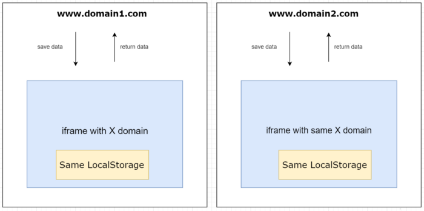

LocalStorage/SessionStorage between different domains
-----

Share data between multiple domains (for example an auth token) can be somehow hard as we all know that all browser side data storage APIs (Localstorage, cookies etc.) are related to one specific domain.

## Solution:
Use an iframe to save the data in localStorage, and then the other domains ask the iframe for what we already saved.

## Credit
Thank to [Mokhles El Heni](https://levelup.gitconnected.com/share-localstorage-sessionstorage-between-different-domains-eb07581e9384)
